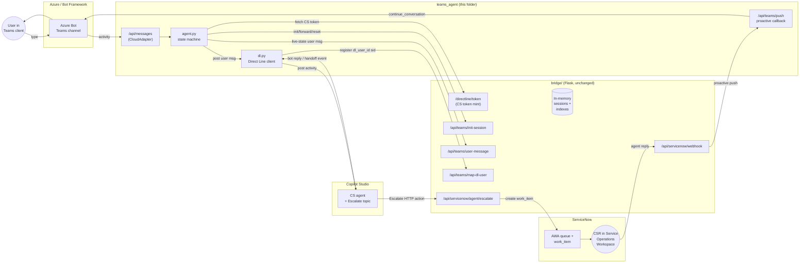

# teams_agent — Teams relay (M365 Agents SDK, Genesys-style)

A Microsoft Teams 1:1 bot built on the supported `microsoft-agents-*`
SDK. Proxies turns to a Copilot Studio agent over Direct Line and
pushes ServiceNow CSR replies into the same Teams chat via
`adapter.continue_conversation`. Pattern adapted from the
[Genesys handoff sample](https://github.com/microsoft/Agents/tree/main/samples/dotnet/GenesysHandoff).

This is one of two Teams channels in the repo. See
[`docs/10-teams-channel-overview.md`](../docs/10-teams-channel-overview.md)
for how it compares to `teams_skill/` (the A2A path), and for why the
older `teams_bot/` (Bot Framework `botbuilder-python`) implementation
was removed.

## Why this pattern

We chose the **Genesys** pattern (over the classic Bot Framework
skill protocol) because:

- Agent SDK app fronts the Teams channel (owns `/api/messages`)
- Forwards user turns to Copilot Studio via Direct Line
- Catches an escalation **event** raised by the CS Escalate topic, then
  takes over the message path itself
- Receives live-agent replies via a webhook → proactively pushes them
  back into the Teams chat via `continue_conversation`
- No user sign-in card (server-side DL token mint via the bridge)

## Architecture

Key points the diagram encode:

- **Single channel owner.** `teams_agent` owns `/api/messages`; the bridge
  never talks to Teams directly. CSR replies reach the user via the bridge's
  outbound `/api/teams/push` → `continue_conversation`.
- **No user sign-in.** Direct Line token is minted **server-side** by the
  bridge from a Copilot Studio Direct Line secret. End users see no OAuth
  card.
- **State machine in three states:** `bot` (forward to CS), `queued`
  (waiting for CSR), `live` (forward to SN AWA work_item via `user-message`).
  See `agent.py` `handle_turn`.
- **DL user-id mapping.** `dl.py` decodes the CS DL token JWT, extracts
  the `user` claim, and registers `dl_user_id → sid` with the bridge so
  the CS Escalate HTTP action's `session_id = System.Activity.From.Id`
  resolves correctly even though it's a CS-minted UUID. See
  [`docs/13`](../docs/13-teams-agent-setup.md) "Behavior notes".
- **Existing browser webchat path is unchanged.** This sits alongside it.

## What's in this folder

| File | Purpose |
| ---- | ------- |
| `config.py` | Env-var loader |
| `state.py` | Per-conversation state: CS conversation id, escalation flag, CS reference |
| `agent.py` | `AgentApplication` subclass — message router + escalation handler |
| `dl.py` | Async Direct Line client (CS token from bridge, JWT user-id decode, map-dl-user) |
| `cs_client.py` | **Unused in DL-parity mode.** Legacy `CopilotClient`/OBO factory kept for reference if you ever switch to the SDK's delegated path |
| `bridge.py` | HTTP calls to the existing Flask bridge (init/escalate/user-message/reset) |
| `app.py` | aiohttp host: `/api/messages` + `/api/teams/push` proactive callback |
| `requirements.txt` | `microsoft-agents-*` 0.9.x + aiohttp |
| `Dockerfile` | Standalone container (port 3978) |
| `manifest/` | Teams app manifest skeleton with NEW bot id placeholders |

## What is NOT touched

- `bridge/` — Flask code unchanged; we call its existing endpoints
- `web/` — browser webchat untouched
- `servicenow/` — AWA queue, BR, scripted REST untouched

## Rollback

Stop this container or unset `TEAMS_AGENT_PUSH_URL` on the bridge; the
web channel keeps working untouched.

## Required Azure setup before running

This runs in **Direct Line parity mode**: the agent talks to Copilot Studio
via the bridge's `/directline/token` proxy, not via the SDK's `CopilotClient`
+ OBO sign-in flow. **No user sign-in card. No Entra OBO app reg. No bot
OAuth connection.** End users open Teams, type, get answer.

1. Azure Bot resource:
   - Auth type: `SingleTenant` (recommended; set `--tenant-id`) or `MultiTenant`
     - `MultiTenant` is **deprecated** in `az bot create` since late 2024;
       use `SingleTenant` unless you specifically need it.
   - Messaging endpoint: `https://<agent-host>/api/messages`
   - Add Microsoft Teams channel (`az bot msteams create`)
2. Copilot Studio agent metadata (Settings → Advanced → Metadata):
   - Schema name → bridge `COPILOTSTUDIO_SCHEMA_NAME`
   - Environment id → bridge `COPILOTSTUDIO_ENVIRONMENT_ID`
   - These live on the **bridge** side, not in `teams_agent/.env`. The
     bridge mints a Direct Line token and the agent picks it up via
     `/directline/token`.
3. Wire the CS **Escalate** topic to call
   `<BRIDGE_PUBLIC_URL>/api/servicenow/agent/escalate` with a JSON body
   that includes `session_id`. The bridge resolves the CS-minted DL user
   UUID back to the agent's `sid` via the `/api/teams/map-dl-user` reverse
   index (registered automatically on every turn — see `dl.py`).

The `OBO_*` and `AZURE_BOT_OAUTH_CONNECTION_NAME` env vars are **read but
not used** in DL-parity mode; they're kept in `config.py` so you can flip
back to the SDK's delegated path without env churn.

Detailed walkthrough lives in [`docs/13-teams-agent-setup.md`](../docs/13-teams-agent-setup.md).

## User commands (chat-side)

The agent intercepts these phrases **before** routing to Copilot Studio
or the live-chat path. They work in any state (`bot`, `queued`, `live`,
`closed`):

| Phrase (case-insensitive) | Effect |
| ------------------------- | ------ |
| `new`, `new chat`, `start new chat` | Drop the bridge session, start a fresh bot conversation |
| `reset`, `-reset` | Same as `new` |
| `start over`, `restart` | Same as `new` |

Implementation: `RESET_COMMANDS` in `agent.py`. The agent calls
`POST /api/teams/reset-session` on the bridge, which removes the
in-memory `BridgeSession` and its `teams_user_key` index entry. The
SN-side `interaction` / `awa_work_item` records remain in SN as history.

## Session auto-recycle

Teams "Clear conversation" only clears the client. The bridge gets no
signal it happened, so without recycling the next user turn would
forward into a dead live-chat. The bridge auto-recycles a stale session
on the next `/api/teams/init-session` call when:

- `state == closed`, OR
- `state == live` and idle &gt; `TEAMS_LIVE_IDLE_RECYCLE_S` (default **900s** / 15 min), OR
- any non-`bot` state and idle &gt; `TEAMS_SESSION_IDLE_TIMEOUT_S` (default **3600s** / 1 hour)

If a real user steps away mid-live-chat for &gt;15 min, their next message
starts a fresh bot turn. Tell users to type `new` if they want to be
explicit, or raise `TEAMS_LIVE_IDLE_RECYCLE_S` for longer-running CSR
chats.
